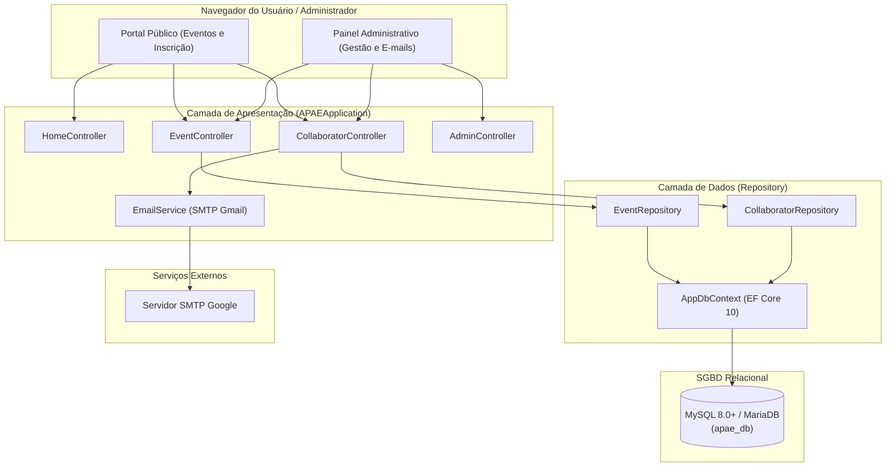
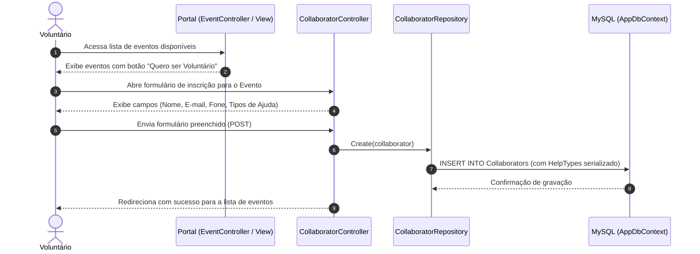
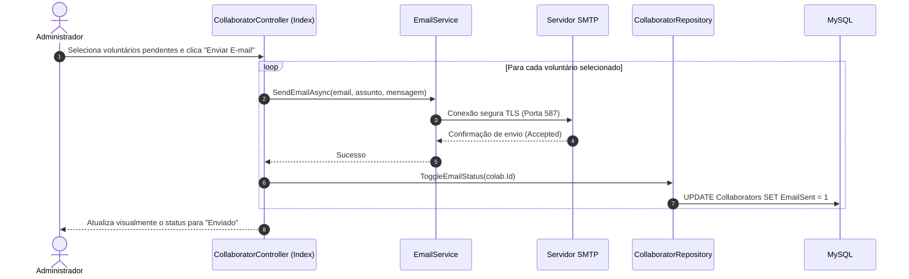

# Diagramas de Arquitetura e Fluxo - Portal Elo APAE

## 1. Diagrama de Blocos da Solução

```mermaid
flowchart TD
    subgraph Client ["Navegador do Usuário / Administrador"]
        UI_Pub["Portal Público (Eventos e Inscrição)"]
        UI_Adm["Painel Administrativo (Gestão e E-mails)"]
    end

    subgraph Presentation ["Camada de Apresentação (APAEApplication)"]
        C_Home["HomeController"]
        C_Event["EventController"]
        C_Colab["CollaboratorController"]
        C_Admin["AdminController"]
        S_Email["EmailService (SMTP Gmail)"]
    end

    subgraph Infrastructure ["Camada de Dados (Repository)"]
        Repo_Event["EventRepository"]
        Repo_Colab["CollaboratorRepository"]
        DbContext["AppDbContext (EF Core 10)"]
    end

    subgraph Database ["SGBD Relacional"]
        MySQL[("MySQL 8.0+ / MariaDB\n(apae_db)")]
    end

    subgraph External ["Serviços Externos"]
        SMTP_Server["Servidor SMTP Google"]
    end

    UI_Pub --> C_Home
    UI_Pub --> C_Event
    UI_Pub --> C_Colab
    UI_Adm --> C_Admin
    UI_Adm --> C_Event
    UI_Adm --> C_Colab

    C_Event --> Repo_Event
    C_Colab --> Repo_Colab
    C_Colab --> S_Email
    S_Email --> SMTP_Server

    Repo_Event --> DbContext
    Repo_Colab --> DbContext
    DbContext --> MySQL
```

---

## 2. Fluxo de Inscrição do Voluntário

```mermaid
sequenceDiagram
    autonumber
    actor Voluntario as Voluntário
    participant Web as Portal (EventController / View)
    participant ColabCtrl as CollaboratorController
    participant Repo as CollaboratorRepository
    participant DB as MySQL (AppDbContext)

    Voluntario->>Web: Acessa lista de eventos disponíveis
    Web-->>Voluntario: Exibe eventos com botão "Quero ser Voluntário"
    Voluntario->>ColabCtrl: Abre formulário de inscrição para o Evento
    ColabCtrl-->>Voluntario: Exibe campos (Nome, E-mail, Fone, Tipos de Ajuda)
    Voluntario->>ColabCtrl: Envia formulário preenchido (POST)
    ColabCtrl->>Repo: Create(collaborator)
    Repo->>DB: INSERT INTO Collaborators (com HelpTypes serializado)
    DB-->>Repo: Confirmação de gravação
    ColabCtrl-->>Voluntario: Redireciona com sucesso para a lista de eventos
```

---

## 3. Fluxo de Disparo de E-mails pelo Administrador

```mermaid
sequenceDiagram
    autonumber
    actor Admin as Administrador
    participant Painel as CollaboratorController (Index)
    participant Svc as EmailService
    participant SMTP as Servidor SMTP
    participant Repo as CollaboratorRepository
    participant DB as MySQL

    Admin->>Painel: Seleciona voluntários pendentes e clica "Enviar E-mail"
    loop Para cada voluntário selecionado
        Painel->>Svc: SendEmailAsync(email, assunto, mensagem)
        Svc->>SMTP: Conexão segura TLS (Porta 587)
        SMTP-->>Svc: Confirmação de envio (Accepted)
        Svc-->>Painel: Sucesso
        Painel->>Repo: ToggleEmailStatus(colab.Id)
        Repo->>DB: UPDATE Collaborators SET EmailSent = 1
    end
    Painel-->>Admin: Atualiza visualmente o status para "Enviado"
```
